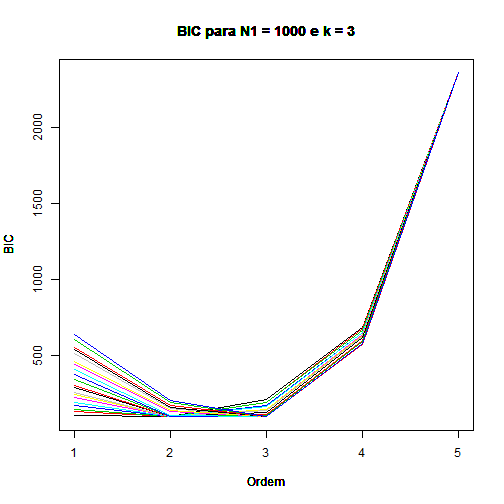
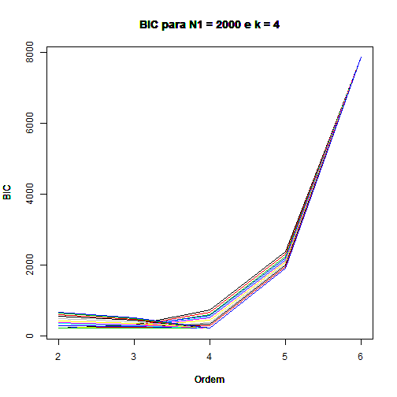
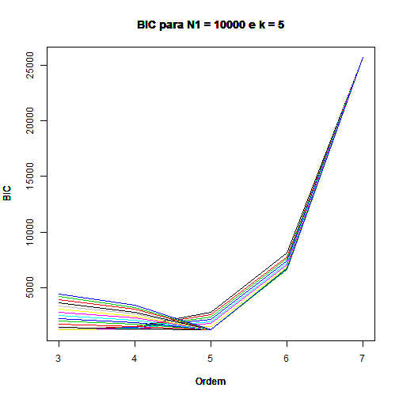
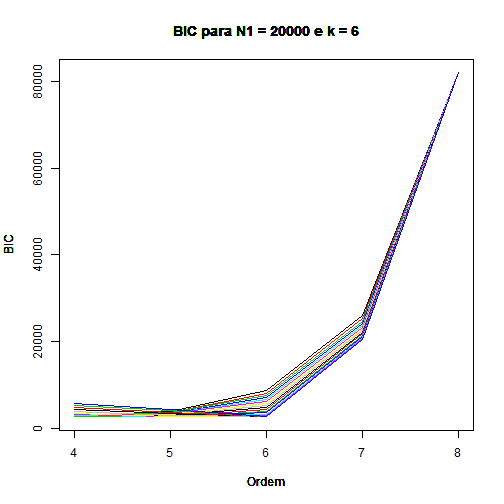

Simulação - Cadeia de Markov e Estimador para a ordem
========================================================

Para fazer esse programa, que simula n passos de uma cadeia de Markov no Espaço de Estados {0,1,2} de ordem k e, com a cadeia simulada, estima a ordem usando o Critério da Informação de Bayes, eu utilizei [esse paper](http://arxiv.org/pdf/0910.0264v5.pdf)  
  
Em primeiro lugar, faço uso da biblioteca expm para produto de matrizes


```r
library(expm)
```

```
## Loading required package: Matrix
## 
## Attaching package: 'expm'
## 
## The following object is masked from 'package:Matrix':
## 
##     expm
```


Crio uma função para comparar matrizes de maneira rápida:


```r
matequal <- function(x, y) is.matrix(x) && is.matrix(y) && all(dim(x) == dim(y)) && 
    all(x == y)
```


Abaixo, a função para fazer a simulação. Ele recebe uma matriz A, que deve ser 3^k x 3 com os elementos de cada linha somando 1, e N, que define o número de passos a ser simulados.  
Os primeiros k passos são simulados uniformemente. Porém, como em geral N é grande, esses passos não devem alterar a convergência do algoritmo de estimação da ordem.  
O valor retornado será um vetor com N elementos no conjunto {0,1,2}.  


```r
SIMULA <- function(A, N) {
    k = round(log(nrow(A), 3))
    SAIDA <- sample(0:2, k, replace = TRUE)
    for (i in ((k):(N - 1))) {
        LINHA = 1
        for (l in 0:(k - 1)) {
            LINHA = LINHA + SAIDA[i - l] * (3^(l))
        }
        SOMA <- 0
        ALE <- runif(1)
        for (j in 1:ncol(A)) {
            SOMA <- SOMA + A[LINHA, j]
            if (ALE <= SOMA) {
                SAIDA <- c(SAIDA, j - 1)
                ALE <- 2
            }
        }
    }
    return(SAIDA)
}
```


Abaixo o código que estima a ordem de uma simulação de cadeia de Markov. Recebe como entrada um vetor de qualquer tamanho com os valores {0,1,2} e retorna um inteiro.  
O algoritmo calcula uma função da verossimilhança (que no paper é dada pela equação da linha 254) para cada possível ordem (que está calibrada entre os valores 1 e 10, mas pode ser alterada), e escolhe a ordem que minimiza essa função.  


```r
ESTIMA <- function(VET) {
    BIC = 1:10
    for (n in 1:10) {
        # Estou considerando ordem no mínimo 1 e no máximo 10
        RES <- matrix(rep(0, 3^n), nrow = 3^n, ncol = 3)
        for (i in n:(length(VET) - 1)) {
            LINHA = 1
            for (l in 0:(n - 1)) {
                LINHA = LINHA + VET[i - l] * (3^(l))
            }
            RES[LINHA, VET[i + 1] + 1] = RES[LINHA, VET[i + 1] + 1] + 1
        }
        RES2 = RES/RES %*% rep(1, ncol(RES)) %*% t(rep(1, ncol(RES)))
        Like = 0
        for (i in n:(length(VET) - 1)) {
            LINHA = 1
            for (l in 0:(n - 1)) {
                LINHA = LINHA + VET[i - l] * (3^(l))
            }
            Like = Like + log(RES2[LINHA, VET[i + 1] + 1])
        }
        BIC[n] = -2 * Like + (3^(n + 1)) * 2 * (3 - 1) * log(n)/2
    }
    RESP = 1:10
    return(RESP[BIC == min(BIC)])
}
```


Abaixo eu fiz uma função para rodar a simulação e o estimador para diferentes ordens. Para gerar a matriz A eu utilizei um gerador aleatório uniforme para cada uma das linhas. Essa função recebe os valores:  
*k: a ordem da matriz gerada. O objetivo do estimador é acertar esse valor.  
*N1: o número de passos simulados na cadeia.  
*N2: o número de corte nos passos.  
  
Por exemplo, se eu gerar uma cadeia de ordem 5, com 1000 passos e 20 cortes, terei como resultado um vetor que mostra qual a estimativa para 1000/20*1 passos, 1000/20*2 passos, até 1000/20*20 passos. Ou seja, conseguimos assim saber qual seria o número mínimo de passos para termos uma estimação correta.


```r
RODAR <- function(k, N1, N2 = 20) {
    l = runif(3^k * 2)
    A = c(min(l[1], l[2]), max(l[2], l[1]) - min(l[1], l[2]), 1 - max(l[2], 
        l[1]))
    for (i in 1:(3^k - 1)) {
        A = rbind(A, c(min(l[2 * i + 1], l[2 * i + 2]), max(l[2 * i + 2], l[2 * 
            i + 1]) - min(l[2 * i + 1], l[2 * i + 2]), 1 - max(l[2 * i + 2], 
            l[2 * i + 1])))
    }
    B <- SIMULA(A, N1)
    
    PI <- matrix(0, 2, nrow = N2)
    colnames(PI) = c("Passos", "Ordem estimada")
    for (i in 1:N2) {
        PI[i, 1] <- i * N1/N2
        PI[i, 2] <- ESTIMA(B[1:(i * N1/N2)])
    }
    return(PI)
}

RODAR(3, 1000)
```

```
##       Passos Ordem estimada
##  [1,]     50              1
##  [2,]    100              1
##  [3,]    150              2
##  [4,]    200              2
##  [5,]    250              2
##  [6,]    300              3
##  [7,]    350              3
##  [8,]    400              3
##  [9,]    450              3
## [10,]    500              3
## [11,]    550              3
## [12,]    600              3
## [13,]    650              3
## [14,]    700              3
## [15,]    750              3
## [16,]    800              3
## [17,]    850              3
## [18,]    900              3
## [19,]    950              3
## [20,]   1000              3
```

```r
RODAR(4, 10000)
```

```
##       Passos Ordem estimada
##  [1,]    500              2
##  [2,]   1000              2
##  [3,]   1500              4
##  [4,]   2000              4
##  [5,]   2500              4
##  [6,]   3000              4
##  [7,]   3500              4
##  [8,]   4000              4
##  [9,]   4500              4
## [10,]   5000              4
## [11,]   5500              4
## [12,]   6000              4
## [13,]   6500              4
## [14,]   7000              4
## [15,]   7500              4
## [16,]   8000              4
## [17,]   8500              4
## [18,]   9000              4
## [19,]   9500              4
## [20,]  10000              4
```

```r
RODAR(5, 10000)
```

```
##       Passos Ordem estimada
##  [1,]    500              2
##  [2,]   1000              2
##  [3,]   1500              2
##  [4,]   2000              2
##  [5,]   2500              4
##  [6,]   3000              4
##  [7,]   3500              4
##  [8,]   4000              4
##  [9,]   4500              4
## [10,]   5000              4
## [11,]   5500              5
## [12,]   6000              5
## [13,]   6500              5
## [14,]   7000              5
## [15,]   7500              5
## [16,]   8000              5
## [17,]   8500              5
## [18,]   9000              5
## [19,]   9500              5
## [20,]  10000              5
```

```r
RODAR(6, 1e+05)
```

```
##       Passos Ordem estimada
##  [1,]   5000              2
##  [2,]  10000              5
##  [3,]  15000              6
##  [4,]  20000              6
##  [5,]  25000              6
##  [6,]  30000              6
##  [7,]  35000              6
##  [8,]  40000              6
##  [9,]  45000              6
## [10,]  50000              6
## [11,]  55000              6
## [12,]  60000              6
## [13,]  65000              6
## [14,]  70000              6
## [15,]  75000              6
## [16,]  80000              6
## [17,]  85000              6
## [18,]  90000              6
## [19,]  95000              6
## [20,] 100000              6
```


Abaixo fiz a mesma função com uma pequena alteração para podermos ver um gráfico dos valores para cada um dos cortes.


```r
ESTIMA2 <- function(VET) {
    BIC = 1:10
    for (n in 1:10) {
        RES <- matrix(rep(0, 3^n), nrow = 3^n, ncol = 3)
        for (i in n:(length(VET) - 1)) {
            LINHA = 1
            for (l in 0:(n - 1)) {
                LINHA = LINHA + VET[i - l] * (3^(l))
            }
            RES[LINHA, VET[i + 1] + 1] = RES[LINHA, VET[i + 1] + 1] + 1
        }
        RES2 = RES/RES %*% rep(1, ncol(RES)) %*% t(rep(1, ncol(RES)))
        Like = 0
        for (i in n:(length(VET) - 1)) {
            LINHA = 1
            for (l in 0:(n - 1)) {
                LINHA = LINHA + VET[i - l] * (3^(l))
            }
            Like = Like + log(RES2[LINHA, VET[i + 1] + 1])
        }
        BIC[n] = -2 * Like + (3^(n + 1)) * 2 * (3 - 1) * log(n)/2
    }
    return(BIC)
}

RODAR2 <- function(k, N1, N2 = 20) {
    l = runif(3^k * 2)
    A = c(min(l[1], l[2]), max(l[2], l[1]) - min(l[1], l[2]), 1 - max(l[2], 
        l[1]))
    for (i in 1:(3^k - 1)) {
        A = rbind(A, c(min(l[2 * i + 1], l[2 * i + 2]), max(l[2 * i + 2], l[2 * 
            i + 1]) - min(l[2 * i + 1], l[2 * i + 2]), 1 - max(l[2 * i + 2], 
            l[2 * i + 1])))
    }
    B <- SIMULA(A, N1)
    
    PI <- matrix(0, 10, nrow = N2)
    for (i in 1:N2) {
        PI[i, 1:10] <- ESTIMA2(B[1:(i * N1/N2)])
    }
    return(PI)
}
```


Abaixo estão os gráficos de como o BIC foi aproximando em cada um dos cortes. A linha em azul, que está mais para cima, é a função do BIC para o vigésimo corte.


```r
A = RODAR2(3, 1000)
for (i in 1:20) {
    plot(type = "l", y = A[i, 1:5], col = i, axes = ifelse(i == 1, T, F), xlab = "Ordem", 
        ylab = "BIC", main = "BIC para N1 = 1000 e k = 3", x = 1:5)
    par(new = ifelse(i == 20, F, T))
}
```

 

```r

A = RODAR2(4, 10000)
for (i in 1:20) {
    plot(type = "l", y = A[i, 2:6], col = i, axes = ifelse(i == 1, T, F), xlab = "Ordem", 
        ylab = "BIC", main = "BIC para N1 = 10000 e k = 4", x = 2:6)
    par(new = ifelse(i == 20, F, T))
}
```

 

```r

A = RODAR2(5, 10000)
for (i in 1:20) {
    plot(type = "l", y = A[i, 3:7], col = i, axes = ifelse(i == 1, T, F), xlab = "Ordem", 
        ylab = "BIC", main = "BIC para N1 = 10000 e k = 5", x = 3:7)
    par(new = ifelse(i == 20, F, T))
}
```

 

```r

A = RODAR2(6, 1e+05)
for (i in 1:20) {
    plot(type = "l", A[i, 4:8], col = i, axes = ifelse(i == 1, T, F), xlab = "Ordem", 
        ylab = "BIC", main = "BIC para N1 = 100000 e k = 6", , x = 4:8)
    par(new = ifelse(i == 20, F, T))
}
```

 

